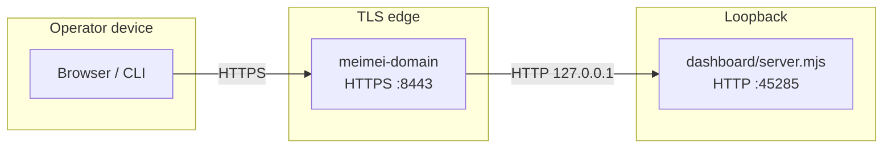

# MeiMei HTTPS topology — v1

**Status:** active (aligned with [ADR-003 — TLS termination](./adr/ADR-003-tls-termination-v1.md) **Accepted**)  
**Companion:** [`docs/planning/meimei-https-full-integration-program.v1.md`](../planning/meimei-https-full-integration-program.v1.md)

## Operator-facing path (canonical)

Browsers and CLI clients that represent **“the MeiMei dashboard”** should use **HTTPS** to the local proxy:

- **`https://<MEIMEI_PUBLIC_HOST>:8443<MEIMEI_PUBLIC_PREFIX>/`**  
- Defaults: host **`meimei.localhost`**, prefix **`/dashboard`** → **`https://meimei.localhost:8443/dashboard/`**

TLS certificates: **`~/.openclaw/certs/meimei.localhost.{crt,key}`** (`npm run cert:install` / `scripts/meimei-cert`).

Trust: install the cert into the **macOS keychain** (script does this) or set **`NODE_EXTRA_CA_CERTS`** to the `.crt` path for Node **`fetch`** / **`curl --cacert`**.

**CI:** **`npm run https:e2e-ci`** (`scripts/meimei-https-e2e-ci.mjs`) proves a real **HTTPS** client path without `meimei.localhost` — ephemeral cert and mini proxy in front of the dashboard.

## Upstream (Node dashboard)

- **`dashboard/server.mjs`** listens with **`http.createServer`** on **`config/dashboard-surface.v1.json`** → **`server.bindHost`** + **`defaults.port`** (typically **`127.0.0.1:45285`**).
- This is **not** a public TLS endpoint; it is the **upstream** for `scripts/meimei-domain.mjs` (HTTPS reverse proxy).
- **Security note (TLS-042):** If a client hits Node **directly** over HTTP and sends **`X-Forwarded-Proto: https`**, treat it as **untrusted** for authorization — it is not cryptographic proof that the user used TLS. Only the **HTTPS proxy** terminates TLS in the default topology. If the proxy is extended to set forwarded headers for logging, use that for **telemetry only**, not for security decisions.
- **Cookies (TLS-043):** The dashboard does not emit **`Set-Cookie`** today; no **`Secure` / `SameSite`** policy applies until session cookies are introduced (then require **`Secure`** on HTTPS-only surfaces).

## Optional: HTTP → HTTPS redirect

When **`MEIMEI_DOMAIN_HTTP_REDIRECT=1`**, `meimei-domain` also listens on **`127.0.0.1:<MEIMEI_DOMAIN_HTTP_REDIRECT_PORT>`** (default **8080**) and responds with **301** to the equivalent **`https://`** URL on **8443**. Use this to train bookmarks and scripts away from mistaken **`http://`** on the proxy host.

## Kernel ↔ in-process apps

Dynamic **`import()`** of external apps does not use HTTP; see [ADR-001](./adr/ADR-001-app-runtime-v1.md).

## Env reference (quick)

| Variable | Role |
|----------|------|
| `MEIMEI_PUBLIC_HOST` | Hostname in public HTTPS URL (default `meimei.localhost`) |
| `MEIMEI_PUBLIC_PREFIX` | Path prefix (default `/dashboard`) |
| `MEIMEI_PUBLIC_TLS_PORT` | Port shown in health / logs (default `8443`) |
| `MEIMEI_DASHBOARD_LOOPBACK_ONLY` | If `1`, Node dashboard binds **`127.0.0.1`** only |
| `MEIMEI_DASHBOARD_DISALLOW_LAN_BIND` | If `1`, **`0.0.0.0` / `::`** bind is coerced to **`127.0.0.1`** |
| `MEIMEI_DASHBOARD_ALLOW_LAN_BIND` | If `1`, allows **`0.0.0.0`** when `MEIMEI_DASHBOARD_DISALLOW_LAN_BIND=1` would otherwise coerce (escape hatch) |
| `MEIMEI_LOG_PUBLIC_HTTPS_HINT` | Set to `0` to suppress the public HTTPS line in dashboard boot logs |
| `MEIMEI_SMOKE_HTTPS` | If `1`, miniapp smoke uses **`https://<host>:8443`** as base |
| `MEIMEI_PROBE_TLS` | If `1`, dashboard probe uses HTTPS (see probe script header) |
| `MEIMEI_DOMAIN_HTTP_REDIRECT` | If `1`, enable HTTP→HTTPS redirect listener in `meimei-domain` |
| `NODE_EXTRA_CA_CERTS` | Path to CA/cert file for Node to trust local HTTPS in CI/scripts |
