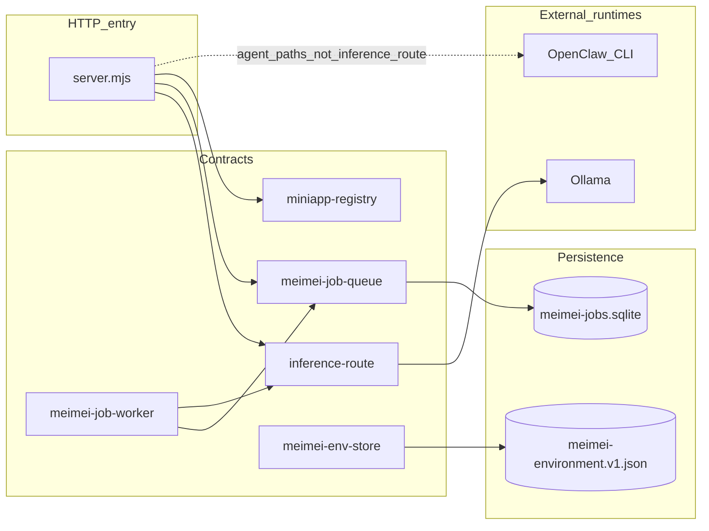

# MeiMei kernel — architectural and code audit

**Document revision:** v1.4  
**Status:** Controlled baseline — update when the kernel allowlist, inference contract, or job schema changes materially.  
**Repository:** `agent-meimei` **0.8.11** (measurements taken **2026-03-30** against the then-current `main` tree).  
**Companion architecture:** [meimei-kernel-completion-plan.v1.md](meimei-kernel-completion-plan.v1.md), [meimei-repo-boundaries.v1.md](meimei-repo-boundaries.v1.md).  
**Integration handbook:** [../developers/meimei-kernel-handbook.v1.md](../developers/meimei-kernel-handbook.v1.md).  
**Vision, theory, application-layer opportunity (v3 audit):** [meimei-system-vision-and-platform-audit.v3.md](meimei-system-vision-and-platform-audit.v3.md).  
**Runtime disclosure (full product):** [../compliance/ai-runtime-audit.md](../compliance/ai-runtime-audit.md).

---

## Document control

| Field | Value |
|-------|--------|
| **Purpose** | Record an evidence-based view of the MeiMei **kernel** (platform core): code layout, contracts, governance gates, commentary practices, and planned structural work. |
| **Scope in** | `dashboard/server.mjs` (HTTP entry), `dashboard/lib/**` modules that implement or adjoin kernel behavior, `functions/registry.v1.json`, CI boundary scripts, inference and job subsystems. |
| **Scope out** | Penetration testing, load/performance benchmarking, OpenClaw gateway configuration internals, third-party model quality, legal/licensing analysis of vendoring. |
| **Method** | Static repository analysis: file inventory, `grep`/`wc` for quantified metrics, crosswalk to written contracts. Line numbers cite **this** snapshot; after large edits to `server.mjs`, re-validate anchors with `grep -n`. |
| **Refresh trigger** | Any change to [meimei-repo-boundaries.v1.md](meimei-repo-boundaries.v1.md) §3 allowlist, `meimei_jobs` schema, or [inference-route.v1.md](../api/inference-route.v1.md) — bump **Document revision** and the measurement date. |

---

## 1. Executive summary

The MeiMei kernel is a **deliberately bounded** control plane: a single Node.js HTTP process that hosts **contract-specified** local inference (`POST /api/meimei/route` → Ollama), a **SQLite-backed** job spooler with an in-process worker for `inference_v1` payloads, operator environment storage, registry-driven routing to miniapps, and static delivery of the design system. Product semantics live in [`apps/*`](../../apps) and in extracted HTML modules under [`dashboard/lib/platform-pages/`](../../dashboard/lib/platform-pages); the kernel **orchestrates** and **enforces layer rules**, rather than embedding long-lived business rules inline.

**Engineering strengths observed**

- **Contract-first inference:** [inference-route.v1.md](../api/inference-route.v1.md) and [`dashboard/lib/inference-route.mjs`](../../dashboard/lib/inference-route.mjs) implement a single, versioned, OpenAI Chat Completions–shaped surface with explicit rejection of unsupported modes (`stream`, non-local runners in v1). That is an integration-grade API, suitable as a stable seam for other systems on the same host or trusted network.
- **Durable async plane:** [`meimei-job-queue.mjs`](../../dashboard/lib/meimei-job-queue.mjs) uses `node:sqlite` with **WAL**, **busy_timeout**, and schema **v2** routing columns (`payload_kind`, `target_adapter`, `source_adapter`), supporting both inference work and sovereign `app_task` processing — consistent with [adapter-contract.v1.md](adapter-contract.v1.md) and inter-app patterns.
- **Enforced modularity:** `npm run boundary:check` combines repository boundary assertions with **no cross-app imports** between `apps/*` trees — reducing accidental coupling as the registry grows.
- **Operational visibility:** [`meimei-monitor-feed.mjs`](../../dashboard/lib/meimei-monitor-feed.mjs) and `GET /api/meimei/monitor/feed` expose job lineage for debugging and the System monitor UI.

**Controlled technical debt (planned, documented)**

- [`dashboard/server.mjs`](../../dashboard/server.mjs) remains a **large file** (see §10). Extraction phases **K1–K2** in the kernel completion plan are the approved remediation path; several `render*` entrypoints are already **thin delegates** to `platform-pages/*`.
- **Dual LLM entry styles** coexist by design during migration: direct [`llm.mjs`](../../dashboard/lib/llm.mjs) usage in some product paths versus the **preferred** inference route for adapters. Phase **K3** aligns these per the platform roadmap.
- **OpenClaw agent turns** (subprocess / gateway) are a **separate** execution path from the kernel inference contract; integrators must not conflate them (see §9 and the compliance audit).

**Verdict for external platform integration**

Treat **`POST /api/meimei/route`** (and, if needed, the job enqueue/read patterns documented in the adapter contract) as the **normative** programmatic seam. The surrounding dashboard UI and legacy call sites are valuable for operators but are **not** required to reuse kernel inference behavior.

---

## 2. Architectural model

### 2.1 Definition

The **kernel** is the union of:

1. **HTTP entry and route orchestration** — [`dashboard/server.mjs`](../../dashboard/server.mjs).
2. **Allowlisted shared libraries** — per [meimei-repo-boundaries.v1.md](meimei-repo-boundaries.v1.md) §3.
3. **Machine registry** — [`functions/registry.v1.json`](../../functions/registry.v1.json) plus [`miniapp-registry.mjs`](../../dashboard/lib/miniapp-registry.mjs).
4. **Persistence primitives** used by the kernel — e.g. `data/meimei/meimei-jobs.sqlite`, `data/meimei-environment.v1.json` (via env store).

It is **not** currently published as a standalone npm package; boundaries are **documentation + CI**, not package graph isolation.

### 2.2 Design invariants

| Invariant | Implementation |
|-----------|----------------|
| **Core does not import across `apps/*`** | Enforced by [`scripts/meimei-apps-cross-import-check.mjs`](../../scripts/meimei-apps-cross-import-check.mjs). |
| **Single documented inference HTTP contract** | `POST /api/meimei/route` → `handleMeimeiInferenceRoute`. |
| **Worker processes only `inference_v1` pending rows** | [`meimei-job-worker.mjs`](../../dashboard/lib/meimei-job-worker.mjs) uses `claimNextInferencePending`; `app_task` rows are claimed by designated processors. |
| **Platform GET HTML for catalog/tool shells** | Lives under `dashboard/lib/platform-pages/*` and **must not** import from `apps/*` (boundaries §3). |
| **Registry strings are not duplicated ad hoc** | `miniapp-registry.mjs` is the programmatic projection of `registry.v1.json`. |

### 2.3 Subsystem relationships

Solid lines: kernel inference and job data path. Dotted: product features that invoke OpenClaw **without** using the OpenAI-shaped inference route (see compliance audit for inventory).

---

## 3. Authoritative module inventory

### 3.1 HTTP entry — verified anchors (snapshot)

Measurements: **`wc -l dashboard/server.mjs` → 2244 lines.**

| Symbol / constant | Approx. line | Role |
|-------------------|-------------|------|
| `meimeiInferenceRoute` | 286 | Path constant `/api/meimei/route` |
| `meimeiMonitorFeedApiRoute` | 288 | Path constant `/api/meimei/monitor/feed` |
| `http.createServer` | 1233 | Request dispatcher start |
| `GET` monitor feed branch | 1251 | Delegates to `meimeiJobQueueRead.listMonitorFeed` |
| `POST` inference branch | 1278 | Trace id resolution, `handleMeimeiInferenceRoute` |
| `server.listen` | 2240 | Bind after surface normalization |

**`render*` functions:** 34 declarations (`grep '^function render' dashboard/server.mjs`). Product GET HTML delegates to `platform-pages/*` for **K1a–K1e** batches; **`renderList`**, **`renderFlashcard`**, **`renderGlobalNav`**, **`renderGlobalNavScript`** remain in `server.mjs` (catalog + nav — **K2** chrome extraction).

### 3.2 Allowlisted `dashboard/lib/*` modules (boundaries §3)

The following table maps **each allowlisted area** to its primary responsibility. Files are relative to `dashboard/lib/`.

| Group | Module(s) | Responsibility |
|-------|-----------|----------------|
| Surface & config | `dashboard-surface.mjs`, `miniapp-registry.mjs`, `page-layout.mjs`, `runtime.mjs` | Listen/surface config load, registry projection, layout merge, shared path/helpers for server |
| Env SoT | `meimei-env-store.mjs` | Operator key/value store + catalog integration |
| Jobs & inference | `meimei-job-queue.mjs`, `meimei-job-worker.mjs`, `meimei-monitor-feed.mjs`, `inference-route.mjs` | Spooler, worker loop, monitor formatting, OpenAI-shaped Ollama router |
| Policy / channels | `api-channel-adapter.mjs`, `external-channel-policy-engine.mjs`, `imessage-adapter.mjs`, `reliability-telemetry.mjs`, `audit-trail.mjs` | API channel routing shell, policy, iMessage bridge hooks, telemetry, audit |
| Legacy inference | `llm.mjs` | Direct Ollama client, JSON robustness, routing config, prompt cache — migration target for hot paths per K3 |
| Checklist integration | `checklist-api-shell.mjs`, `checklist-local-integration.mjs`, `checklist-bridge-http.mjs`, `checklist-bridge.mjs`, `checklist-node/*` | Shell POST, local proxy, bridge HTTP, Node engine surface |
| Platform pages | `platform-pages/catalog-pages.mjs`, `system-monitor-page.mjs`, `tool-surface-pages.mjs`, `reference-app-pages.mjs`, `ops-tool-pages.mjs`, `gtm-pages.mjs`, `reader-pages.mjs`, `routing-settings-pages.mjs`, `home-admin-pages.mjs` | Server-side HTML for catalog, monitor, tool UIs, reference demos, ops tools, GTM apps, reader surfaces, routing/API **settings**, home + admin |

### 3.3 `dashboard/lib/*` present but **not** on the “pure core” allowlist

Per boundaries §3, these modules exist in-tree and are **candidates for re-homing** or explicit labeling; the server may still import them for product features:

`lead-enrichment-workflow.mjs`, `gtm-analytics.mjs`, `sdr-analytics.mjs`, `supabase-connector.mjs`, `home-suggestions.mjs`, `command-interface.mjs`, `mail-adapter.mjs`, `telemetry.mjs`, `brain/index.mjs`, `brain/memory.mjs`, `admin-layout-editor.mjs`, `reference-app-queue-api.mjs`, `reference-app-2-queue-api.mjs`, `meimei-reference-app-inbox.mjs`, `app-router.mjs`.

**Audit note:** Their presence is **intentional** today; the architectural action is to keep the **allowlist** truthful and avoid silent growth of “misc” core files without a boundaries update.

### 3.4 Registry artifacts

| Artifact | Role |
|----------|------|
| [`functions/registry.v1.json`](../../functions/registry.v1.json) | Canonical ids, routes, API paths, catalog metadata |
| [`functions/*.md`](../../functions) | Per-function contracts (transport, env, behavior) |
| `npm run registry:validate` | Mechanical validation of registry shape |

---

## 4. Behavioral contracts (kernel)

### 4.1 Inference route

**Normative spec:** [inference-route.v1.md](../api/inference-route.v1.md).  
**Implementation:** [`handleMeimeiInferenceRoute`](../../dashboard/lib/inference-route.mjs).

| Concern | Behavior |
|---------|----------|
| Transport | HTTP `POST`, JSON body |
| Runner | Ollama OpenAI-compatible **`/v1/chat/completions`** at `OLLAMA_HOST` (default `http://127.0.0.1:11434`) |
| Model selection | Explicit tag or `router-auto` + deterministic `TASK_CATEGORY_TO_MODEL` map |
| Context guard | Estimated tokens vs `MEIMEI_INFERENCE_MAX_CONTEXT` (default 8192) → **413** |
| Unsupported | `stream: true` → **501**; `meimei.localOnly: false` → **501** (v1) |
| Correlation | Trace id: header `x-meimei-trace-id` overrides body, else UUID; echoed in `meimei_meta` |

### 4.2 Job queue — public surface (`createMeimeiJobQueue`)

The object returned by `createMeimeiJobQueue(repoRoot)` includes, among others:

| Method | Semantics |
|--------|-----------|
| `enqueueIngress(opts)` | Insert pending row; derives `payload_kind` / adapters via `deriveRoutingMeta` |
| `claimNextInferencePending` | Single-row claim for global inference worker |
| `claimNextAppTaskForTarget(adapter)` | Sovereign inbox claim for `app_task` |
| `markCompleted` / `markPermanentFailure` / `markRetryOrDeadLetter` | Terminal and retry transitions |
| `getJobByIdForAdapter` / `getJobByIdForParty` | Scoped reads for adapters |
| `listInboxAppTasksForTarget` / `listAppTasksForTraceParty` | Inbox and trace-scoped listings |
| `listMonitorFeed` | Newest-first global or chronological trace filter |
| `resetProcessingToPending` | Startup safety for stale `processing` rows |

Storage: **`data/meimei/meimei-jobs.sqlite`**, WAL + `busy_timeout` **8000 ms**.

### 4.3 Job worker

[`startMeimeiJobWorker`](../../dashboard/lib/meimei-job-worker.mjs): polls `claimNextInferencePending`, executes inference via `handleMeimeiInferenceRoute`, applies retry policy until `MEIMEI_JOB_MAX_FAILURES`, supports **Claim Check** spill to `data/meimei/artifacts/<trace>/digest.md` when assistant payload exceeds **64 KiB**, and may enqueue correlated `app_task` replies when `meimei_correlation` is present. Disabled when `MEIMEI_JOB_WORKER=0`.

### 4.4 Monitor feed

Server maps SQL rows through [`formatMonitorFeedRows`](../../dashboard/lib/meimei-monitor-feed.mjs) for human-readable System monitor lines, including forward compatibility for unknown `payload_kind` values.

---

## 5. HTTP dispatch order and rationale

The server uses **sequential conditional dispatch** (not a framework router). Order is security- and integration-sensitive:

1. **Health** — cheap liveness for watchdogs and proxies.  
2. **Monitor feed** — read-only JSON for operations.  
3. **`POST /api/meimei/route`** — bounded, audited inference contract.  
4. **Checklist proxy / public path** — integration boundary before generic static.  
5. **Static files** under `public/` — with path traversal checks.  
6. **JSON APIs** — including miniapp `POST` delegation.  
7. **HTML** — `render*` + layout merge.

This ordering prevents accidental shadowing of operational and contract endpoints by later generic handlers.

---

## 6. Concurrency, consistency, and failure domains

| Domain | Mechanism | Notes |
|--------|-----------|--------|
| SQLite writers | WAL + `busy_timeout` | Multiple processes may enqueue; worker and server share DB file |
| Stale `processing` | `resetProcessingToPending` at worker start | Mitigates crash mid-job |
| Ollama unavailable | HTTP **503** from inference route | Caller must retry or surface operator error |
| OpenClaw / gateway | Separate from inference route | Failures affect agent/iMessage paths, not necessarily Ollama-only tools |

**Blast radius:** Kernel inference failure is **localized** to callers of `/api/meimei/route` and inference jobs; the dashboard may remain up for non-LLM routes.

---

## 7. Security and deployment posture

| Topic | Position |
|-------|----------|
| **Threat model** | Operator-local control plane: assume trusted admin network unless TLS termination and authentication are added **outside** this repository’s defaults. |
| **Secrets** | `meimei-env-store` persists entries to disk under repo `data/` — protect filesystem permissions and backups accordingly. |
| **Inference** | No multi-tenant auth in v1 contract; rate limiting and abuse prevention are **consumer responsibilities** when exposing the API beyond localhost. |

---

## 8. Verification and governance matrix

| Command | What it proves |
|---------|----------------|
| `npm run boundary:check` | Repository boundary rules + zero cross-imports between apps |
| `npm run registry:validate` | Registry JSON integrity |
| `npm run policy:validate` | External channel policy artifacts |
| `npm run audit:validate` | Audit trail schema/rules |
| `npm run telemetry:validate` | Telemetry definitions |
| `npm run handoff:validate` | Handoff artifact sample |
| `npm run adapter:whatsapp:validate` / `imessage:validate` | Adapter contract checks |
| `npm run release:gates` | Release gate sample |
| **`npm run ci`** | Superset of the above (see [`package.json`](../../package.json)) |

**What CI does not prove:** Runtime compatibility with a live Ollama model set, OpenClaw gateway availability, or end-to-end latency SLOs.

---

## 9. Runtime topology and disclosure alignment

The kernel delivers a **well-defined local inference plane** (Ollama via OpenAI-shaped HTTP). The **wider product** also uses OpenClaw agent turns, deterministic routing rules, and in some surfaces sample or non-LLM data — cataloged in [ai-runtime-audit.md](../compliance/ai-runtime-audit.md).

**Integration rule:** When describing capabilities to downstream teams or customers, separate:

- **Contracted kernel inference** — `POST /api/meimei/route` behavior per v1 spec.  
- **Product features** — each mapped to its actual backend in the compliance audit.

This separation is not a weakness of the kernel; it is **accurate system documentation** for a platform that intentionally combines multiple execution backends.

---

## 10. Alignment with kernel completion plan (K1–K4)

| Phase | Objective | Audit assessment |
|-------|-----------|------------------|
| **K1** | Extract remaining GET/settings HTML from `server.mjs` | **K1 complete** for planned batches (**K1a–K1e**); **`renderList` / flashcard / global nav** remain for catalog (**K2**). |
| **K2** | Consolidate shared chrome (nav, list/flashcard) | **Open** — home/admin HTML is in **`home-admin-pages.mjs`**; **`renderGlobalNav`**, **`renderList`**, **`renderFlashcard`** still in `server.mjs` (catalog). |
| **K3** | Prefer inference route / jobs for LLM alignment (R1/R2) | **Ongoing** — `llm.mjs` remains in active use alongside migration. |
| **K4** | Trace propagation polish, smoke gates | **Per roadmap** — monitor and correlation foundations exist; CI smoke policies evolve per roadmap. |

---

## 11. Documentation embedded in code (commentary audit)

### 11.1 Measurement method

- **Population:** all `dashboard/lib/**/*.mjs` files (**49** files on 2026-03-30).  
- **File-top module banner:** first non-whitespace character begins `/**`.  
- **`@param` prevalence:** file contains at least one `@param`.  
- **Limitation:** These metrics do not measure prose quality or architectural accuracy—only structural JSDoc presence.

### 11.2 Results

| Scope | Files | File-top `/**` | Files with `@param` |
|-------|------:|---------------:|--------------------:|
| `dashboard/lib/**/*.mjs` | 49 | 31 (**63.3%**) | 25 (**51.0%**) |
| `apps/**/*.mjs` | 12 | 12 (**100%**) | 1 (**8.3%**) |
| `dashboard/server.mjs` | 1 | 0 | 0 |

### 11.3 Qualitative rubric (peer-review style)

| Grade | Characteristics | Examples in-tree |
|-------|-----------------|------------------|
| **A** | Module banner links normative doc; exported APIs carry `@param`/`@returns`; integration risks stated | `inference-route.mjs`, `miniapp-registry.mjs`, `checklist-bridge-http.mjs`, `meimei-repo-boundaries-check.mjs` (script) |
| **B** | Clear section headers or export comments; contract discoverable with brief search | `llm.mjs` (section banners; large surface) |
| **C** | Correct code, sparse narrative; maintainers rely on reading implementation | `runtime.mjs`, parts of `meimei-env-store.mjs` |
| **Server entry** | Mid-file route-cluster comments; **no** file-level architecture preamble | `server.mjs` |

**TODO/FIXME:** Essentially **absent** in first-party `.mjs` — debt appears to be tracked in issues/roadmaps rather than inline markers.

### 11.4 Recommended standard for new kernel contributions

1. **Module-level** `/**` block: purpose, normative doc link, invariants (e.g. “must not import `apps/*`”).  
2. **Exported functions** that cross package boundaries: JSDoc types or `@param` for non-obvious shapes.  
3. **Server changes:** one-line delegate to `platform-pages/*` or `apps/*` — no new multi-hundred-line HTML blocks.  
4. **Boundaries doc** updated in the same change set when allowlist membership changes.

---

## 12. Completeness statement

This audit is **complete** relative to its **Document control** scope: kernel boundaries, primary contracts, persistence, HTTP dispatch, governance commands, commentary metrics, and planned structural work.

**Explicit non-goals (not performed here):** security penetration testing, load testing, formal verification of model outputs, legal review of third-party reuse.

---

## 13. Revision log

| Revision | Date | Summary |
|----------|------|---------|
| v1.0 | 2026-03-30 | Initial kernel audit, lifecycles, commentary metrics. |
| v1.1 | 2026-03-30 | Architect-grade restructure: document control, full allowlist inventory, queue API surface, concurrency/failure domains, governance matrix, corrected `server.mjs` line anchors (3840 lines), disclosure alignment framing, completeness statement. |
| v1.2 | 2026-03-30 | K1c reader extraction: `server.mjs` **~2924** lines; HTTP anchor refresh; allowlist + K1 table note **reader-pages.mjs**; repository baseline **0.8.9**. |
| v1.3 | 2026-03-30 | K1d routing settings: `server.mjs` **~2680** lines; HTTP anchor refresh; allowlist + **routing-settings-pages.mjs**; repository baseline **0.8.10**. |
| v1.4 | 2026-03-30 | K1e home/admin: `server.mjs` **~2244** lines; **34** `render*`; HTTP anchor refresh; allowlist + **home-admin-pages.mjs**; K1 batch table complete; repository baseline **0.8.11**. |
