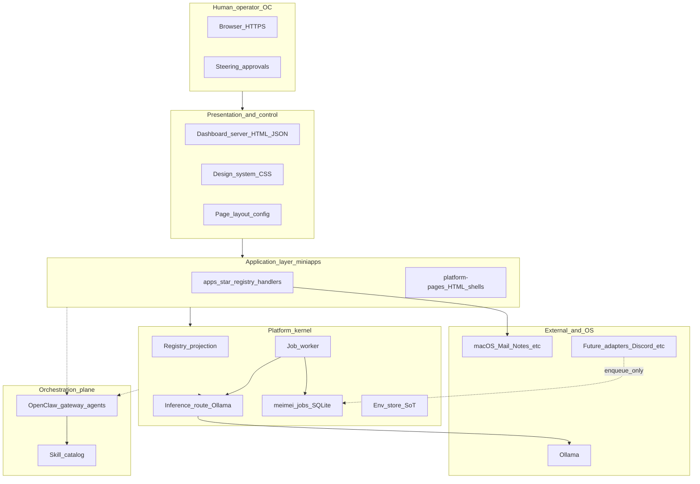

# MeiMei system vision, platform architecture, and application-layer audit — v3

**Document type:** strategic and architectural synthesis (the **third audit**).  
**Focus:** what this system **is for**, **why it is shaped this way**, **how work flows** through it, and **what can be built on top** — not whether specific lines of code execute correctly.  
**Evidence audit (code, inventory, CI):** [meimei-kernel-code-audit.v1.md](meimei-kernel-code-audit.v1.md).  
**Integration handbook:** [../developers/meimei-kernel-handbook.v1.md](../developers/meimei-kernel-handbook.v1.md).  
**Research basis:** systematic review of `docs/**/*.md` (architecture, governance, adapters, compliance, operations, agent identity, API), root [README.md](../../README.md), and binding contracts referenced below — **2026-03-30**.

---

## 1. Role of this document

| Audit generation | Primary question |
|------------------|------------------|
| **v1** (initial) | What files exist, rough lifecycles, commentary metrics. |
| **v1.1** (evidence) | Document control, allowlists, contracts, line anchors, CI matrix, completeness vs scope. |
| **v3 (this)** | **Teleology and composition:** purpose, principles, layered design, pipelines, and **application-layer opportunity space**. |

Readers who need **onboarding narrative** and **platform theory** should start here, then drill into the code audit and handbook for implementation truth.

---

## 2. What this system is for (north star)

**Product identity:** MeiMei is an **OpenClaw-native product agent** for sustained, multi-skill work, paired with **OC** (human control partner) who steers, approves, and accepts delivery — see [agent-identity/agent.md](../agent-identity/agent.md).

**Repository identity:** `agent.meimei` is the **source of truth** for agent identity, operating rules, skill catalog, OpenClaw collaboration model, backlog, and release discipline — stated explicitly in the root [README.md](../../README.md). It is **markdown-first** so behavior and policy stay inspectable rather than buried only in code.

**Runtime identity:** The same repository hosts a **local operator control plane**: a Node dashboard, registry of **miniapps** (operator-facing capabilities), integration with **Ollama** (local inference) and **OpenClaw** (orchestration/gateway/agents), macOS bridges (e.g. Mail), and a growing **adapter** and **job** ecosystem — summarized in [system-overview.md](system-overview.md) and detailed in platform contracts.

**In one sentence:** MeiMei is a **human-steered, contract-governed agent platform** that combines **orchestrated agent execution** (OpenClaw), **explicit local inference and tool APIs** (dashboard + Ollama), **durable narrative memory** (Brain markdown), and **machine-checkable governance** (readiness, registry, policy, release gates) so OC can scale capability without losing control.

---

## 3. Theoretical and design foundations

This section names the **ideas** the architecture embodies — drawn from in-repo specs, not generic industry buzzwords alone.

### 3.1 Dual execution planes (orchestration vs contracted inference)

The platform intentionally separates:

- **OpenClaw plane:** execution, routing, gateway, agent turns, skills — OC configures and operates via the OpenClaw stack ([system-overview.md](system-overview.md), root README).
- **Contracted inference plane:** `POST /api/meimei/route` — OpenAI-shaped, versioned, blocking v1 to Ollama — [inference-route.v1.md](../api/inference-route.v1.md).

**Why it matters:** Integrators and new features can target a **stable HTTP+JSON seam** without re-implementing OpenClaw’s orchestration. Agent workflows and “tool HTTP” can evolve on different cadences. The [ai-runtime-audit.md](../compliance/ai-runtime-audit.md) catalogs which product surfaces sit on which plane — essential for honest external communication.

### 3.2 Adapter quarantine and the job spooler (shock absorption)

**Theory:** External I/O (webhooks, filesystem, chat networks) is **bursty, flaky, and unbounded**. Coupling that to the HTTP request thread or ad-hoc LLM calls creates tail latency and failure cascades.

**Practice:** [adapter-contract.v1.md](adapter-contract.v1.md) and [meimei-app-development-guide.v1.md](meimei-app-development-guide.v1.md) mandate:

1. **Ingress:** adapters normalize events → **small JSON** → **enqueue** `meimei_jobs` (SQLite, WAL).
2. **Worker:** bounded claim, inference via **router**, retries, dead letters.
3. **Egress:** side effects in dedicated processes, not inside the router hot path.

This is a classic **queue-based integration** pattern adapted for a single-machine operator product.

### 3.3 Local message bus and sovereign apps (actor-style collaboration)

**Theory:** If App A `fetch`es App B’s HTTP API for async work, you get **synchronous coupling**, timeout chains, and opaque logs.

**Practice:** [inter-app-message-bus.v1.md](inter-app-message-bus.v1.md) defines **`app_task`** envelopes over the **same** SQLite spooler: communicate by **messages (rows)**, not open request chains. Receivers **claim** work, validate `intent`, and remain **sovereign** over execution. **Claim Check** (artifact paths instead of huge payloads in rows) keeps the control plane bounded — explicit reference to the enterprise integration pattern.

### 3.4 Contract-first miniapps

**Theory:** Predictable shapes beat one-off endpoints for review, safety, and multi-channel expansion.

**Practice:** [miniapp-contract-v1.md](miniapp-contract-v1.md) freezes **v1**: stable routes (`/dashboard/<issueId>/<slug>`), API paths, input/output/safety/capabilities/failure model. Registry + `functions/<id>.md` tie machine and human truth — alignment roadmap §1 pillar “Registry & docs.”

### 3.5 Deterministic policy where trust requires explainability

**Theory:** When OC must **inspect** or **audit** decisions, opaque neural routing is the wrong user experience.

**Practice:** [model-routing-spec.md](model-routing-spec.md) requires routing to be **deterministic, explainable**, channel/task/cost-aware. The inference route’s `router-auto` maps **task categories** to models deterministically — not an LLM selecting another LLM (see compliance audit for product wording alignment).

### 3.6 Markdown-native memory and transparency

**Theory:** Operator memory should survive tooling changes and remain **diffable** and **reviewable**.

**Practice:** Brain layers (`identity`, `user`, `context`, `skills`, `durable`, `log`) as markdown — [system-overview.md §2](system-overview.md). LLM augmentation **reads and appends**; git history becomes a weak form of audit for narrative memory.

### 3.7 Governance as product infrastructure

**Theory:** Quality scales when gates are **repeatable**, not heroic.

**Practice:** Readiness ([README.md](../../README.md) `oc-readiness`), registry validation, policy validation, audit trail schema, release gates, handoff artifacts — documented across `docs/governance`, `docs/contracts`, `docs/compliance`, and `package.json` `ci` script. Vocabulary is standardized in [project-vocabulary-v1.md](project-vocabulary-v1.md).

---

## 4. High-level system architecture

### 4.1 Layered view (conceptual)

Solid arrows: primary data/control paths for dashboard-backed capabilities. Dotted: OpenClaw orchestration and future adapter ingress (enqueue-only per contract).

### 4.2 Network split (operator LAN / loopback)

[system-overview.md § Network Architecture](system-overview.md) describes the **HTTPS proxy** splitting traffic: dashboard and function APIs vs OpenClaw gateway. The kernel handbook notes **HTTP** dashboard vs **HTTPS** public entry — alignment roadmap explicitly documents non-uniformity rather than papering it over.

### 4.3 Vocabulary alignment

Use [project-vocabulary-v1.md](project-vocabulary-v1.md) terms in architecture discussions: **Miniapp**, **Adapter**, **Policy engine**, **Readiness gate**, **Release gate**, **Audit trail**, **Design system**, etc.

---

## 5. Low-level design (platform kernel vs application layer)

### 5.1 Kernel (thin orchestration shell + shared services)

The **kernel** is the enforceable **core platform** in the alignment roadmap: HTTP shell, registry load, env apply, job queue/worker, inference route, design-system static hosting, shared telemetry/policy hooks — **without** embedding each product’s business rules. Allowlist and rules: [meimei-repo-boundaries.v1.md](meimei-repo-boundaries.v1.md). **Implementation inventory:** code audit v1.1.

### 5.2 Application layer (what ships as product)

| Construct | Location / artifact | Role |
|-----------|---------------------|------|
| **Miniapp / tool** | `functions/registry.v1.json` + `apps/<id>/` + `functions/<id>.md` | Operator-facing capability, POST handler, contract |
| **Platform UI** | Home, admin, knowmore, monitor shell | Chrome, not catalog rows |
| **Integration** | `integrations/*`, checklist bridge modules | External repo/service glue |
| **Adapter daemon** | e.g. `scripts/meimei-adapter-obsidian.mjs` | Ingress only → queue |

### 5.3 Cross-cutting: secrets and config

Single operator SoT for applied env: **meimei-env-store** + catalog — [meimei-app-development-guide.v1.md §5](meimei-app-development-guide.v1.md), [meimei-env-ui-contract.v1.md](meimei-env-ui-contract.v1.md). Application code **must not** invent parallel secret stores.

---

## 6. Workflows and pipelines

### 6.1 Synchronous miniapp call (operator clicks UI)

1. Browser issues **POST** to registry API path (normalized on dashboard).  
2. Server parses body, delegates to **`handleApi`** in `apps/<id>/index.mjs`.  
3. Handler may read env, disk, Brain, Mail, or call **legacy** `llm.mjs` / **preferred** enqueue or `/api/meimei/route` per alignment pillars.  
4. Response follows miniapp contract **output** rules (explicit `ok` / errors).

### 6.2 Async inference pipeline (adapter / burst / worker)

Per [meimei-app-development-guide.v1.md §4](meimei-app-development-guide.v1.md) and [adapter-contract.v1.md](adapter-contract.v1.md):

1. **Ingress:** Adapter inserts **`inference_v1`** row with OpenAI-shaped `request` in payload.  
2. **Worker** claims FIFO pending inference job.  
3. **Router:** `handleMeimeiInferenceRoute` → Ollama.  
4. **Result:** `result_json` or retry / dead letter; optional **correlation** → new **`app_task`**.  
5. **Monitor:** `GET /api/meimei/monitor/feed` for lineage.

### 6.3 Inter-app pipeline (sovereign delegation)

Per [inter-app-message-bus.v1.md](inter-app-message-bus.v1.md):

1. Producer enqueues **`app_task`** with `target_adapter`, `source_adapter`, opaque `payload` / `intent`.  
2. Consumer **inbox worker** claims by target.  
3. Consumer may enqueue **`inference_v1`**, write artifacts, or enqueue reply **`app_task`**.  
4. Large content → **Claim Check** path under `data/meimei/artifacts/<trace_id>/`.

### 6.4 Natural-language command path (product UX)

[system-overview.md §4](system-overview.md): suggestions + intent parsing + `executeCommand` — navigates or invokes tools. This is **product orchestration** at the UX layer; it composes the same miniapps and libs rather than replacing contracts.

### 6.5 OpenClaw agent turn (orchestration path)

Root README and system overview: **`oc-agent`** and gateway — agent execution, logs, skills. This path is **orthogonal** to the inference route contract; both coexist by design.

---

## 7. What can be built on the application layer

This is the **forward-looking** core of the v3 audit: the platform is already shaped to support classes of extensions without re-architecting the kernel.

### 7.1 New registry miniapps

- Add `functions/<id>.md` + registry row + `apps/<id>/index.mjs`.  
- Obey [miniapp-contract-v1.md](miniapp-contract-v1.md) and R1–R8 alignment dimensions ([meimei-platform-alignment-roadmap.v1.md §4](meimei-platform-alignment-roadmap.v1.md)).  
- Prefer **queue + inference route** for new LLM work; avoid peer **`fetch`** between apps for async delegation.

### 7.2 New ingress adapters

- Separate **Node process** or LaunchAgent: validate external event → **enqueue** only.  
- Examples and patterns: [adapter-contract.v1.md](adapter-contract.v1.md), [adapter-obsidian.v1.md](adapter-obsidian.v1.md), demo scripts in README.

### 7.3 External systems consuming MeiMei as a **local inference + job service**

- **HTTP:** `POST /api/meimei/route` for OpenAI-shaped calls.  
- **Jobs:** enqueue via shared queue module or future documented HTTP ingress receiver (contract allows dedicated receiver — not the inference URL).  
- **Constraints:** auth, TLS, and multi-tenant policy are **consumer responsibilities** in v1.

### 7.4 Multi-step “workflows” without spaghetti

- Model workflows as **state machines** over **queue rows** + **trace_id**, not chains of synchronous HTTP between miniapps.  
- Use **correlation** fields documented in the bus spec for standup / digest patterns.

### 7.5 Channel expansion (Discord, WhatsApp, Email, etc.)

- Architecture specs exist under `docs/adapters/*` (phased plans, parity rules).  
- **Pattern:** adapter normalizes → policy engine / audit trail as required by governance docs → enqueue → worker → egress.

### 7.6 Optional future: packaged kernel

[meimei-kernel-completion-plan.v1.md](meimei-kernel-completion-plan.v1.md) §4 mentions npm workspaces (`@meimei/kernel`) — same contracts, stronger isolation. Application layer remains **registry + adapters + UI**.

---

## 8. Strategic tensions and documentation discipline

Two truths must coexist for **professional** delivery:

1. **Aspirational architecture** in system overview and identity docs emphasizes LLM-native, local-first, transparent memory.  
2. **Compliance audit** ([ai-runtime-audit.md](../compliance/ai-runtime-audit.md)) lists **per-surface** reality: some paths are rules-only, sample, or non-LLM.

**v3 position:** This is not a contradiction if roles are separated: **platform contracts** (inference route, queue, bus) define what **new** work **must** do; **legacy or UX-specific** surfaces are scored Yellow/Red in the miniapp audit until migrated. External messaging should cite the **compliance audit** for feature-level claims and **this v3 doc** + **inference-route v1** for integration-level claims.

---

## 9. Alignment pillars (requirements baseline)

The platform roadmap §1 defines **what “aligned” means** — summarized here as the **scorecard spine** for application-layer work:

| Pillar | One-line expectation |
|--------|----------------------|
| Job spooler | Async/burst work → `meimei_jobs` with documented payloads |
| Inference | New/refactored LLM → `/api/meimei/route` or enqueued `inference_v1` |
| Inter-app | Delegation → `app_task` + trace + Claim Check — not peer HTTP |
| Secrets | Single env SoT + catalog; nothing secret in client DOM |
| UI | Design system + layout model |
| Observability | `trace_id` + monitor feed for queue-backed flows |
| Registry | Registry + `functions/<id>.md` accurate |

Full methodology: [meimei-platform-alignment-roadmap.v1.md](meimei-platform-alignment-roadmap.v1.md).

---

## 10. Documentation map (research corpus)

This v3 audit was synthesized from the **docs/** tree (77 markdown files at time of research), with weight on:

- **Architecture:** system overview, boundaries, kernel plan, alignment roadmap, adapter + bus + app dev guide, miniapp contract, model routing, function lifecycle, design system.  
- **API:** inference-route v1.  
- **Agent identity:** agent, vocabulary-linked concepts.  
- **Compliance:** ai-runtime-audit, miniapp-platform-audit (for R1–R8 framing).  
- **Governance / contracts:** AGENTS, policy engine, release gates, handoff — for “gates as infrastructure.”  
- **Operations / adapters:** runbook, launchd, headless server, adapter architectures — for deployment and channel context.

**Not done in v3:** line-by-line reading of every operations runbook paragraph or every adapter phase-3 detail; those remain **authoritative in situ** when implementing that slice.

---

## 11. Revision log

| Version | Date | Summary |
|---------|------|---------|
| v3.0 | 2026-03-30 | Initial vision + platform + application-layer audit; theoretical foundations, layered architecture, pipelines, extension space, doc map. |

---

**Maintained with:** [meimei-kernel-code-audit.v1.md](meimei-kernel-code-audit.v1.md) (evidence) and [../developers/meimei-kernel-handbook.v1.md](../developers/meimei-kernel-handbook.v1.md) (integration).
