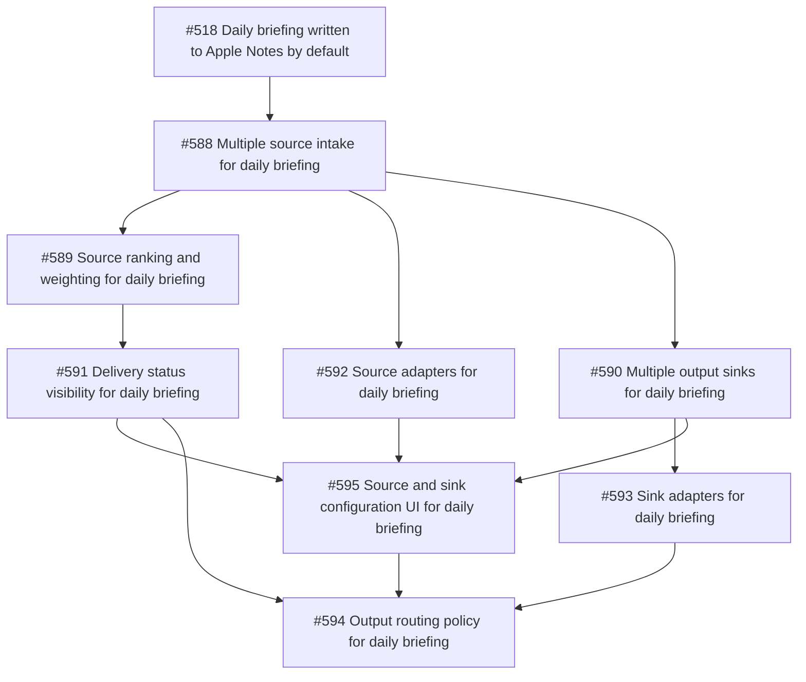
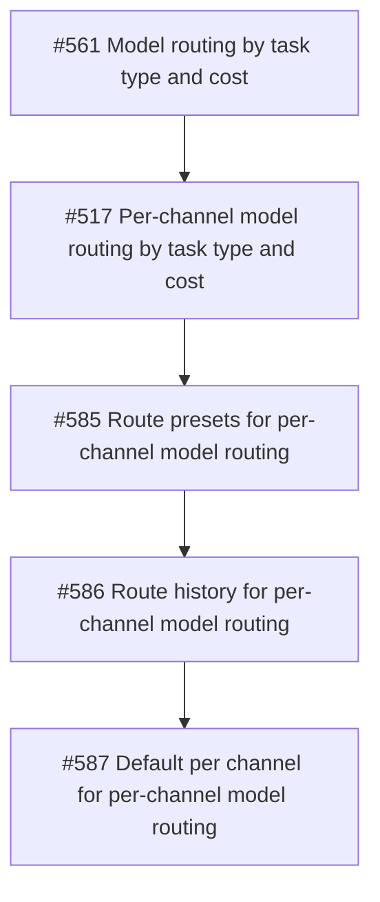

# MeiMei Idea Support Map

This document records which ideas act as foundations for other ideas, and which ideas depend on them.

## Core Foundation

- `#563` Agent email inbox integration
- `#564` Durable memory backbone upgrade
- `#565` Agent-specific browser default setup
- `#567` ClawHub skill discovery and reuse flow
- `#568` QMD memory backend support and documentation
- `#569` Browser reliability on VPS and remote hosts
- `#570` Beginner-first useful OpenClaw onboarding
- `#571` Cost-aware API-heavy setup guidance
- `#572` Integrated mail, memory, and browser workflow

## URL Summarization Family

- `#573` Copy summary result to clipboard
- `#574` PDF metadata and citations
- `#575` URL summary history
- `#576` Pipeline status panel
- `#577` Progress stage reporting
- `#578` URL error states
- `#579` Advanced summarization controls
- `#580` Long article layout
- `#581` Trust signals in results
- `#582` Shared MeiMei navigation
- `#583` Summary API access
- `#584` Shared function lifecycle

## Per-Channel Routing Family

- `#517` Per-channel model routing by task type and cost
- `#561` Model routing by task type and cost
- `#585` Route presets for per-channel model routing
- `#586` Route history for per-channel model routing
- `#587` Default per channel for per-channel model routing

## Daily Briefing Family

- `#518` Daily briefing written to Apple Notes by default
- `#588` Multiple source intake for daily briefing
- `#589` Source ranking and weighting for daily briefing
- `#590` Multiple output sinks for daily briefing
- `#591` Delivery status visibility for daily briefing
- `#592` Source adapters for daily briefing
- `#593` Sink adapters for daily briefing
- `#594` Output routing policy for daily briefing
- `#595` Source and sink configuration UI for daily briefing

## Daily Briefing Prerequisite Order

1. `#588` defines the multi-source intake foundation.
2. `#589` adds source ordering on top of intake.
3. `#590` defines the multi-sink foundation.
4. `#591` adds delivery status visibility across the pipeline.
5. `#592` modularizes source behavior behind adapters.
6. `#593` modularizes sink behavior behind adapters.
7. `#594` defines the sink-selection policy.
8. `#595` exposes the source and sink controls in the UI.

## Daily Briefing Dependency Tree

## Strict Prerequisite Order

1. `#561` defines the routing policy and cost-aware model choice rules.
2. `#517` applies that policy to per-channel routing behavior.
3. `#585` adds reusable route presets on top of the per-channel routing flow.
4. `#586` adds route history after presets exist, so routing decisions can be reviewed in a stable flow.
5. `#587` adds the per-channel default toggle last, once presets and history already exist.

## Dependency Tree

## Support Relationships

### Foundation to downstream ideas

- `#563` supports `#570` and `#572`
- `#564` supports `#570`, `#572`, `#575`, and `#581`
- `#565` supports `#566`, `#569`, `#570`, and `#572`
- `#567` supports `#560` and `#584`
- `#568` supports `#564`
- `#569` supports `#565`, `#566`, and `#572`
- `#570` supports `#559`, `#560`, `#563`, `#564`, `#565`, `#571`, and `#572`
- `#571` supports `#560`, `#563`, `#564`, `#565`, `#568`, `#572`, `#579`, `#580`, `#581`, and `#583`
- `#572` supports the wider utility stack by combining `#563`, `#564`, and `#565` into one workflow

### URL summarization add-ons supporting one another

- `#573` supports `#575` and `#583`
- `#574` supports `#579`, `#580`, and `#581`
- `#576` supports `#577` and `#581`
- `#577` supports `#576` and `#578`
- `#578` supports `#570`, `#579`, and `#581`
- `#579` supports `#574`, `#580`, and `#581`
- `#580` supports `#574` and `#581`
- `#581` supports `#574`
- `#582` supports the broader MeiMei function family, starting with `#516`
- `#583` supports `#536`, `#537`, `#540`, and `#572`
- `#584` supports `#516` and the future MeiMei function family

### Per-channel routing support chain

- `#561` supports `#517`
- `#517` supports `#585`
- `#585` supports `#586`
- `#586` supports `#587`

### Daily briefing support chain

- `#588` supports `#589`, `#592`, and `#595`
- `#589` supports `#591` and `#595`
- `#590` supports `#591`, `#593`, `#594`, and `#595`
- `#591` supports `#594` and `#595`
- `#592` supports `#589`, `#595`, and future source expansion
- `#593` supports `#591`, `#594`, and `#595`
- `#594` supports `#591`, `#593`, and `#595`
- `#595` ties source and sink behavior together as the control layer

## Practical Reading

- Use the foundation issues as prerequisites when a later issue needs the underlying capability.
- Use the URL summarization add-ons as supporting layers that improve trust, reuse, and observability.
- Use the daily briefing add-ons as a pipeline, not as isolated stories, because source intake, sink choice, and configuration all depend on one another.
- When a new issue depends on one of these foundations, record that dependency explicitly in the issue body.
